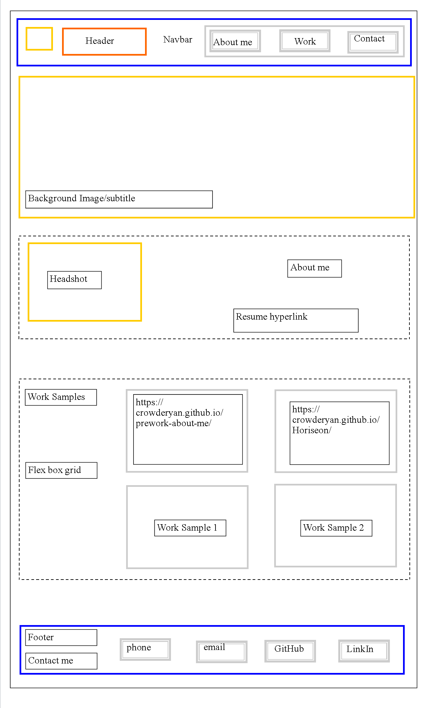
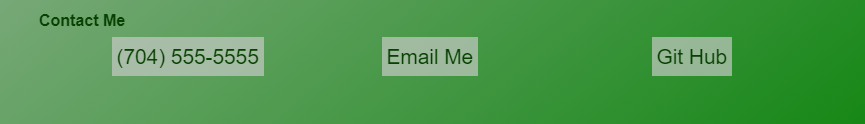

# 02 Advanced CSS: Portfolio (Explanation ReadMe)

Link to Website: https://crowderyan.github.io/Portfolio/

1. Basic Wireframe of intended site:
   

2. Responsive Sections:

- A. Navigation:

  
  

- B. Projects:

  
  

- C. Contacts:

  
  

3. Comments included to label sections in HTML and CSS:

   

   
